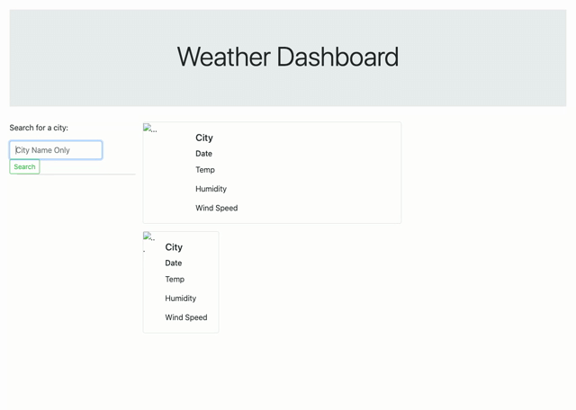

# Weather-API

Purpose:
To create a weather dashboard that will use the OpenWeather API to call the weather for a user inputted city. It will populate the current weather as well as the 5 day forecast. It will also display the list of searched cities.

Demonstration:

Deployed Site: https://drfrank22.github.io/Weather-API/